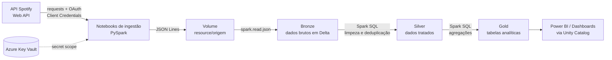

# 🎧 Spotify Lakehouse · Azure Databricks

Pipeline de engenharia de dados que consome a **API do Spotify**, armazena os dados em um **Data Lake no Azure (ADLS Gen2)** e os organiza na **arquitetura Medallion** (Bronze, Silver e Gold) com **Azure Databricks**, **Unity Catalog**, **PySpark** e **Spark SQL**.

O objetivo é demonstrar, de ponta a ponta, a configuração do ambiente em nuvem, a ingestão de uma API REST, o tratamento dos dados em camadas e a entrega de tabelas analíticas prontas para consumo.

---

## 📐 Arquitetura



Todos os dados ficam fisicamente no **ADLS Gen2**, e o **Unity Catalog** é a camada de governança que controla o acesso às tabelas e volumes.

---

## Tecnologias

| Categoria | Ferramentas |
|---|---|
| Nuvem | Microsoft Azure |
| Armazenamento | Azure Data Lake Storage Gen2 |
| Processamento | Azure Databricks, Apache Spark (PySpark e Spark SQL) |
| Governança | Unity Catalog (catálogo, schemas, volumes, storage credential, external location) |
| Formato | Delta Lake |
| Segurança | Azure Key Vault, Access Connector for Azure Databricks, Azure RBAC |
| Fonte de dados | Spotify Web API (REST, OAuth 2.0) |
| Linguagens | Python, SQL |

---

## Configuração do ambiente Azure

1. **Grupo de recursos** para agrupar todos os serviços do projeto.
2. **Storage Account** com *hierarchical namespace* habilitado (ADLS Gen2) e um **container** dedicado ao Databricks.
3. **Workspace do Azure Databricks** na mesma região do storage.
4. **Access Connector for Azure Databricks**, uma identidade gerenciada que o Databricks usa para acessar o storage. O conector recebeu a função **Storage Blob Data Contributor** na Storage Account, sem uso de chaves de acesso.
5. **Azure Key Vault** com modelo de permissões **RBAC**, guardando o `client_id` e o `client_secret` do app do Spotify:
   - Função **Key Vault Secrets Officer** para o usuário administrador, que cadastra os segredos.
   - Função **Key Vault Secrets User** para a aplicação corporativa **AzureDatabricks**, que é a identidade usada pelo Databricks para ler segredos de *secret scopes* ligados ao Key Vault.

> **V.I.P:** Um aprendizado da configuração: atribuir as funções do Key Vault apenas ao próprio usuário não é suficiente. Quem lê o segredo durante a execução do notebook é a aplicação AzureDatabricks, e sem essa atribuição a leitura retorna `403 Forbidden`.

---

## Configuração do Databricks e Unity Catalog

**Acesso ao storage**

- **Storage credential** apontando para o Access Connector.
- **External location** cobrindo o container do projeto, usando essa credencial.
- **Cluster** com Unity Catalog habilitado.

**Secret scope ligado ao Key Vault**

Criado em `https://<workspace-url>#secrets/createScope`, informando o *DNS Name* e o *Resource ID* do Key Vault. Os segredos são lidos no código sem nunca aparecer em texto:

```python
client_id = dbutils.secrets.get("spotify", "spotify-client-id")
client_secret = dbutils.secrets.get("spotify", "spotify-client-secret")
```

> Scopes ligados ao Key Vault aceitam apenas letras, números e hífen nos nomes dos segredos, por isso `spotify-client-id` e não `spotify_client_id`.

**Estrutura do catálogo `spotify`**

| Schema | Conteúdo | Localização no ADLS |
|---|---|---|
| `landing` | Volume externo `spotify_resource`, com os JSONs brutos da API | `spotify/resource` |
| `bronze` | Tabelas Delta com os dados brutos | `spotify/bronze` (managed location) |
| `silver` | Tabelas Delta tratadas | `spotify/silver` (managed location) |
| `gold` | Tabelas Delta analíticas | `spotify/gold` (managed location) |

```sql
CREATE CATALOG IF NOT EXISTS spotify;

CREATE SCHEMA IF NOT EXISTS spotify.bronze
MANAGED LOCATION 'abfss://<container>@<storage-account>.dfs.core.windows.net/spotify/bronze';

CREATE EXTERNAL VOLUME IF NOT EXISTS spotify.azure.spotify_resource
LOCATION 'abfss://<container>@<storage-account>.dfs.core.windows.net/spotify/resource';
```

**Tabelas gerenciadas e organização física**

As tabelas das camadas são **managed tables**. Dentro da pasta de cada camada, o Unity Catalog organiza os arquivos por identificadores (`_unitystorage/schemas/<id>/tables/<id>`), cada um com seu `_delta_log` e seus arquivos Parquet. Os consumidores acessam os dados pelo nome da tabela no catálogo (por exemplo `spotify.gold.artist_discography`), e não pelo caminho no storage. Isso garante permissões, auditoria, linhagem e leitura consistente das versões do Delta Lake.

Para localizar os arquivos de uma tabela:

```sql
DESCRIBE DETAIL spotify.bronze.artists;
```

---

## Consumo da API do Spotify

**Autenticação:** fluxo **Client Credentials**, adequado para pipelines automatizados, pois não exige login de usuário e dá acesso aos dados públicos do catálogo.

**Endpoints utilizados**

| Endpoint | Dados | Tabela bronze |
|---|---|---|
| `GET /artists/{id}` | Artista | `bronze.artists` |
| `GET /artists/{id}/albums` (paginado) | Álbuns e singles do artista | `bronze.albums` |
| `GET /albums/{id}/tracks` (paginado) | Faixas de cada álbum | `bronze.album_tracks` |

**Função de consumo**

Uma única função centraliza as chamadas, aceitando tanto o caminho relativo quanto a URL completa devolvida no campo `next` da paginação, e respeitando o rate limit da API (`429` com o header `Retry-After`):

```python
def consumir_api(endpoint, params=None):
    url = endpoint if endpoint.startswith("http") else f"https://api.spotify.com/v1/{endpoint}"

    while True:
        resp = requests.get(url, headers=headers, params=params, timeout=30)

        if resp.status_code == 429:
            espera = int(resp.headers.get("Retry-After", 5))
            time.sleep(espera)
            continue

        if resp.status_code != 200:
            print(f"Erro {resp.status_code}: {resp.text}")
        resp.raise_for_status()
        return resp.json()
```

**Paginação**

```python
endpoint = f"artists/{artist_id}/albums"
params = {"include_groups": "album,single", "market": MARKET, "limit": 10}

while endpoint:
    resposta = consumir_api(endpoint, params)
    for album in resposta["items"]:
        album["artist_id"] = artist_id
        albuns.append(album)
    endpoint = resposta["next"]
    params = None
```

**Adaptação às mudanças da API em 2026**

Em fevereiro de 2026, o Spotify restringiu os apps em modo de desenvolvimento. O projeto foi construído considerando essas mudanças:

- Os campos `popularity` e `followers` foram removidos dos artistas, e as análises foram desenhadas sem depender deles.
- Os endpoints de busca em lote (`/artists`, `/albums`, `/tracks`) foram removidos, então cada item é buscado individualmente.
- O parâmetro `limit` do endpoint de álbuns do artista passou a aceitar no máximo 10, e a paginação garante a coleta completa.
- As respostas de faixas não trazem o ID do álbum, e as de álbuns não indicam de qual artista partiu a busca. Por isso, os campos `album_id` e `artist_id` são acrescentados na ingestão, preservando os relacionamentos.

---

## Camada Bronze

Cada endpoint tem seu próprio notebook, que segue três passos:

1. **Consome a API** com a função `consumir_api`.
2. **Salva a resposta bruta** no volume em formato JSON Lines, com data e hora no nome do arquivo:
   `/Volumes/spotify/azure/spotify_resource/origem/artists/artists_2026-09-23_141140.json`
3. **Grava a tabela Delta** na bronze, sem transformações, apenas com colunas de controle:

```python
df = (
    spark.read.json(caminho)
    .withColumn("_ingestion_timestamp", F.current_timestamp())
    .withColumn("_source_file", F.lit(caminho))
)

(
    df.write
    .mode("append")
    .option("mergeSchema", "true")
    .saveAsTable("spotify.bronze.artists")
)
```

- **`append`** preserva o histórico de todas as cargas.
- **`mergeSchema`** evita falhas caso a API passe a devolver campos novos.
- **`_ingestion_timestamp`** e **`_source_file`** permitem rastrear a origem de cada registro.

---

## Camada Silver

Construída em **Spark SQL**, com as seguintes regras:

- **Deduplicação:** como a bronze é append, cada entidade mantém apenas sua versão mais recente, usando `QUALIFY` com `ROW_NUMBER()`.
- **Tratamento de arrays e structs:** o array `images` traz a mesma imagem em três tamanhos, e `try_element_at` seleciona a primeira, que é a maior, devolvendo nulo em vez de erro quando o array está vazio (seguro com o modo ANSI).
- **Filtro de qualidade:** registros sem ID são descartados.
- **Idempotência:** `CREATE OR REPLACE TABLE` reprocessa a partir da bronze, podendo ser executado várias vezes sem duplicar dados.

```sql
CREATE OR REPLACE TABLE spotify.silver.albums AS

WITH albums_recentes AS (
  SELECT
    id AS album_id,
    artist_id,
    name AS album_name,
    release_date,
    total_tracks,
    try_element_at(images, 1) AS image,
    _ingestion_timestamp
  FROM spotify.bronze.albums
  WHERE id IS NOT NULL
  QUALIFY ROW_NUMBER() OVER (PARTITION BY id ORDER BY _ingestion_timestamp DESC) = 1
)
SELECT
  album_id,
  artist_id,
  album_name,
  release_date,
  total_tracks,
  image.height AS image_height,
  image.url AS image_url,
  image.width AS image_width,
  _ingestion_timestamp,
  current_timestamp() AS _processed_at
FROM albums_recentes
ORDER BY ALBUM_ID;
```

**Tabelas**

| Tabela | Granularidade | Chave |
|---|---|---|
| `silver.artists` | Uma linha por artista | `artist_id` |
| `silver.albums` | Uma linha por álbum | `album_id` |
| `silver.album_tracks` | Uma linha por faixa | `track_id` |

---

## Camada Gold

Tabelas agregadas e prontas para consumo por analistas de BI e cientistas de dados.

| Tabela | Descrição |
|---|---|
| `gold.artist_discography` | Uma linha por artista: total de lançamentos e faixas, primeiro e último ano de lançamento, anos de carreira e duração média das músicas |
| `gold.duration_by_year` | Duração média das faixas por artista e ano de lançamento, com a quantidade de faixas para dar contexto à média |

```sql
CREATE OR REPLACE TABLE spotify.gold.duration_by_year AS

SELECT
  ar.artist_id,
  ar.name AS artist_name,
  COUNT(t.track_id) AS total_tracks,
  EXTRACT(YEAR FROM al.release_date) AS year_release,
  ROUND(AVG(t.music_duration_ms) / 60000, 2) AS avg_track_minutes,
  current_timestamp() AS _processed_at
FROM spotify.silver.artists ar
LEFT JOIN spotify.silver.albums al ON al.artist_id = ar.artist_id
LEFT JOIN spotify.silver.album_tracks t ON t.album_id = al.album_id
GROUP BY ar.artist_id, ar.name, year_release
ORDER BY ARTIST_ID, year_release ASC; 
```

**Cuidados de modelagem aplicados**

- A data de lançamento chega com precisões diferentes (`2019`, `2019-05` ou `2019-05-10`), e `EXTRACT YEAR FROM` extrai o ano de forma consistente para todos os formatos.
- A ordenação fica nas consultas, e não na criação das tabelas, já que tabelas não garantem ordem física.

---

## 📁 Estrutura do repositório

```
├── setup/
│   └── setup.ipynb              # schemas e volume no Unity Catalog
├── bronze/
│   ├── bronze.ipynb
├── silver/
│   ├── silver.ipynb
├── gold/
│   ├── gold.ipynb
└── README.md
```

---

## ▶️ Como executar

1. Configure os recursos do Azure e do Databricks conforme as seções acima.
2. Crie um app no [Spotify for Developers](https://developer.spotify.com/dashboard) e cadastre o `client_id` e o `client_secret` no Key Vault.
3. Rode `setup/setup.ipynb`, substituindo `<container>` e `<storage-account>`.
4. Preencha a lista `ARTIST_IDS` em `bronze/bronze.ipynb`. O ID de cada artista está na URL do perfil: `https://open.spotify.com/artist/<id>`.
5. Execute os notebooks na ordem: **bronze** (artists → albums → tracks), **silver** e **gold**.

---

## 🚀 Próximos passos

- Orquestrar os notebooks em um **Databricks Job (Lakeflow Jobs)** com dependências entre as tarefas e agendamento.
- Criar tabelas de relacionamento (`album_artists`, `track_artists`) para analisar colaborações entre artistas.
- Registrar logs de execução no schema de metadados.
- Construir um dashboard em cima da camada gold com Databricks SQL ou Power BI.

---

## 👤 Autor

**Seu nome** · [LinkedIn](https://www.linkedin.com/in/seu-perfil) · [GitHub](https://github.com/seu-usuario)
